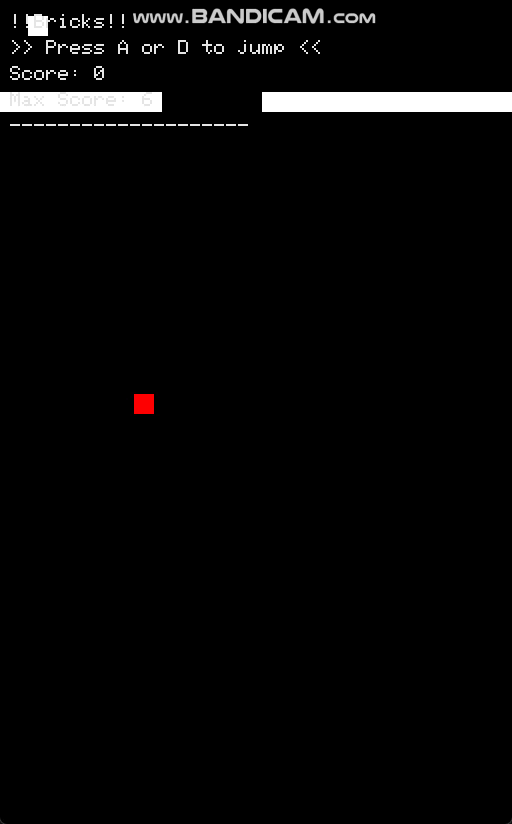

# Bricks

A Simple Game build from scratch.



## Compile & Run

### Windows

1. use script: `build_vs2022.bat` or

2. use `CMakeLists.txt`

    ```sh
    mkdir build
    cd build
    cmake ..
    cmake --build .
    ```

### MacOS

1. use `makefile`

    ```sh
    make
    ```

### Build it yourself

Since no other dependencies are required, you can simply build it manually.

For Windows, compile the following files with `-lgdi32`:

```
    platform/win32.cpp
    src/game.cpp
    src/gui.cpp
    src/image.cpp
    src/main.cpp
```

for MacOS, compile the following files using clang, with `-framework Cocoa`:

```
    platform/macos.mm
    src/game.cpp
    src/gui.cpp
    src/image.cpp
    src/main.cpp
```